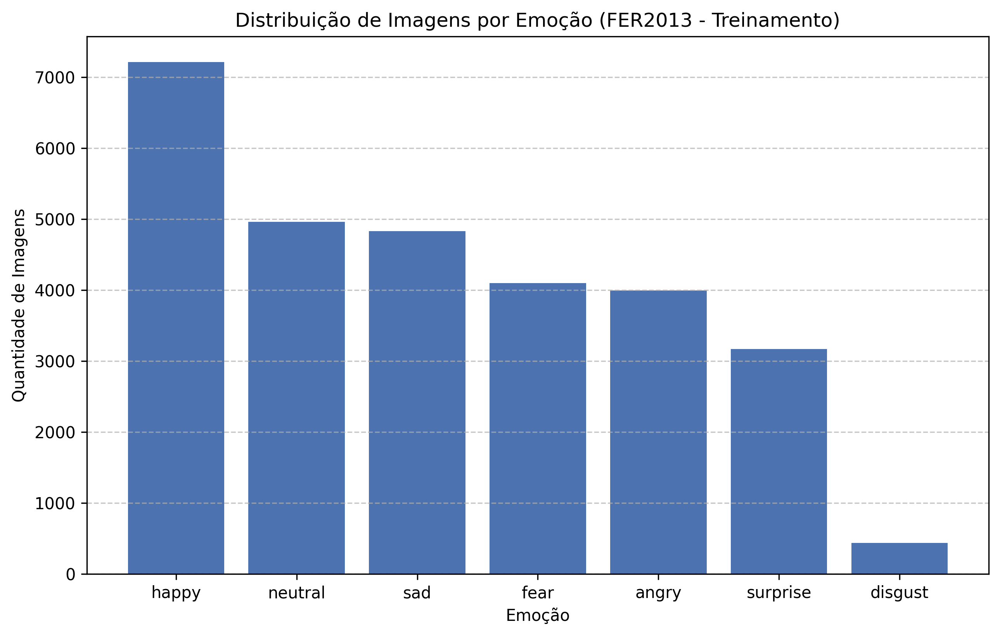

# Reconhecimento de Expressões Faciais (FER) com Deep Learning


Este repositório contém o código-fonte e os experimentos metodológicos do Trabalho de Conclusão de Curso (TCC) em Ciência da Computação desenvolvido na Universidade Federal de São Carlos (UFSCar).

**Autor:** João Victor Pacini  
**Orientador:** Prof. Dr. Alexandre Luís Magalhães Levada  

---

## Escopo do Projeto
O objetivo desta pesquisa é investigar, implementar e comparar arquiteturas de Redes Neurais Convolucionais (CNNs) estáticas para a classificação de microexpressões humanas utilizando o dataset **FER2013** (*In-the-wild*). O trabalho explora os desafios crônicos de bases de dados reais, como ruído severo e desbalanceamento extremo de classes, propondo mitigações através de *Data Augmentation*, pesos matemáticos e *Transfer Learning*.

## Análise Exploratória (EDA) e Desafios
A análise inicial do FER2013 revelou uma forte discrepância na distribuição das amostras, ditando o rumo dos experimentos de mitigação de viés:
* **Classe Majoritária:** *Happy* (Alegria) representa ~25% do dataset.
* **Classe Minoritária:** *Disgust* (Nojo) representa apenas ~1.5% do dataset.

<div align="center">
  
</div>

---

## Metodologia e Experimentos Realizados

O pipeline de pesquisa foi estruturado em testes progressivos, visando não apenas a máxima acurácia, mas a compreensão de *como* a rede aprende e falha.

### 1. Baselines e Avaliação de Transfer Learning
* **CNN Customizada (Baseline Absoluto):** Arquitetura leve construída do zero. Alcançou **~54%** de acurácia de validação, mas apresentou *overfitting* de memorização.
* **VGG16 & ResNet50 (Transfer Learning Rígido):** Aplicação de pesos do *ImageNet* com base congelada. Modelos estagnaram na faixa de **40-42%**, indicando que características espaciais generalistas não se traduzem bem para imagens *grayscale* de 48x48 sem reajuste fino.

### 2. Estratégias de Mitigação de Viés (Combate ao Desbalanceamento)
Para lidar com a cegueira da rede para as classes minoritárias ("Nojo" e "Medo"), as seguintes abordagens foram testadas sobre a arquitetura Baseline:
* **Class Weights Matemáticos:** Penalização severa para erros nas minorias. Resultou em *overfitting* destrutivo (91% Treino / 46% Teste), com a rede decorando os pixels das raras imagens.
* **SMOTE (Synthetic Minority Over-sampling):** Tentativa de interpolação matemática de pixels. Gerou ruído visual ("imagens fantasmas") que invalidou o aprendizado.
* **Sinergia (Data Augmentation + Class Weights):** A introdução de variações geométricas dinâmicas combinada com penalidades matemáticas estabilizou o aprendizado. A rede encerrou com **~48%** de acurácia real, eliminando totalmente a curva de divergência de *overfitting*.

---

## Próximos Passos
* Implementar um script robusto de visualização cruzada de métricas (Curvas de Aprendizado e *Loss*).
* Explorar o *Fine-Tuning* profundo em redes densas (ex: MobileNet ou EfficientNet).
* Investigar arquiteturas temporais (RNNs/LSTMs) em vídeos para captura de dinâmica facial.

---

## Como Reproduzir os Experimentos

Todos os testes foram isolados em *Jupyter Notebooks* independentes para garantir clareza e controle de variáveis.

1. Clone o repositório.
2. Instale as dependências garantindo compatibilidade com aceleração GPU no Windows:
```bash
pip install tensorflow==2.10
pip install "numpy<2.0" "pandas<2.0"
pip install matplotlib seaborn scikit-learn